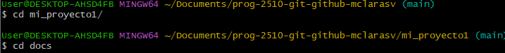

# Instrucciones para el uso de la consola
Para usar la consola es muy importante saber usar los comandos básicos, como son: `ls` que sirve para ver la lista de archivos del computador.
`cd` que sirve para entrar a archivos y documentos.

`mkdir` sirve para crear carpetas.

`touch` sirve para crear archivo.

`cd ..`sirve vara regresar a una ubicacion anterior en el equipo.

Para renombrar un archivo usamos `mv nombre_actual nombre_nuevo`.
Para eliminar un archivo usamos `rm nombre_archivo` y el nombre del archivo.

Para eliminar un directorio usamos `rm -r nombre_directorio`
